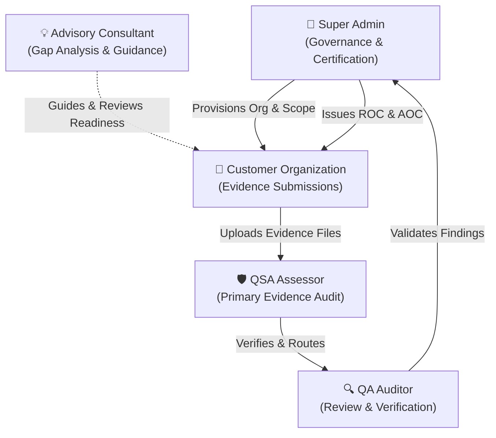
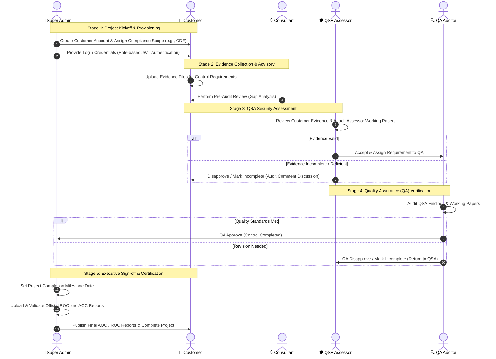
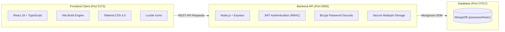

# Panacea Infosec Compliance Portal — Complete Workflow & Architecture Guide

Welcome to the **Panacea Infosec Compliance & Security Assessment Portal**. This document provides an end-to-end overview of how the platform operates, the responsibilities of each user role, the lifecycle of a compliance project from kickoff to final certification, critical milestones, and the underlying technology stack.

---

## 1. Executive Summary & Core Objective

The portal is designed for security assessment firms (such as Panacea Infosec) and their enterprise customers to execute, manage, and verify compliance audits (e.g., **PCI-DSS**, **ISO 27001**, **HIPAA**, **SOC 2**, etc.). 

Instead of exchanging evidence files and audit findings via scattered emails and spreadsheets, this portal provides a **single, secure, auditable workspace** where:
1. Organizations upload compliance evidence.
2. Qualified Security Assessors (QSAs) evaluate requirements.
3. Quality Assurance (QA) auditors verify the rigor of the assessment.
4. Administrators oversee progress, manage users, and issue official **ROC** (*Report on Compliance*) and **AOC** (*Attestation of Compliance*) reports.

---

## 2. User Roles & Responsibilities

There are **5 distinct roles** in the system, each with specific permissions and tasks:

### Role Breakdown

| Role | Badge Color | Primary Purpose & Responsibility |
| :--- | :--- | :--- |
| **👑 Super Admin** | `Purple` | **Platform Governance & Final Certification:** Creates customer accounts, defines compliance scopes, assigns assessors, oversees project deadlines, and publishes official ROC/AOC reports. |
| **🏢 Customer** | `Sky Blue` | **Evidence Submission:** Represents the client company being audited. Responds to each control requirement by uploading policies, logs, configurations, and requesting scope adjustments when necessary. |
| **💡 Advisory Consultant** | `Amber` | **Readiness & Remediation Guidance:** Reviews customer evidence before formal audits, flags compliance gaps, and helps customers prepare before QSA evaluation. |
| **🛡️ QSA Assessor** | `Teal` | **Primary Security Auditor:** Evaluates uploaded evidence against each compliance requirement. Accepts valid evidence (routing to QA), disapproves non-compliant controls, or marks items incomplete. |
| **🔍 QA Auditor** | `Indigo` | **Secondary Quality Reviewer:** Performs independent verification on QSA assessments to ensure consistency, rigor, and compliance before final sign-off. |

---

## 3. End-to-End Compliance Lifecycle

A typical assessment engagement follows a **5-stage sequential workflow**:

---

## 4. Detailed Stage Breakdown

### Stage 1: Provisioning & Account Setup
1. **Admin Setup**: The Super Admin registers the client organization (e.g., company name, primary contact, industry).
2. **Scope Definition**: The Admin selects the compliance service (e.g., *PCI-DSS 4.0*) and creates the target scope / process (e.g., *Cardholder Data Environment - CDE*).
3. **Assessor Assignment**: Specific QSA, QA, and Advisory Consultant team members are assigned to the project.
4. **Secure Authentication**: Users log in securely with their email and password, authenticated via encrypted JWT tokens and routed automatically to their designated role dashboard.

---

### Stage 2: Evidence Upload & Control Response
1. The customer logs into their **Customer Workspace**.
2. For each control requirement (e.g., *Requirement 1.1: Firewall Configuration Standards*):
   - The customer uploads supporting documents (PDF, DOCX, XLSX, PNG, logs).
   - The customer provides implementation notes or submission remarks.
   - If a requirement is not applicable or requires scope adjustments, the customer can click **Request Requirement Modification**.

---

### Stage 3: QSA Assessment & Working Papers
1. The QSA opens the **QSA Audit Matrix**.
2. The QSA downloads and inspects the customer's uploaded files.
3. The QSA can attach their own **Assessor Working Papers** (e.g., test results, sampling logs, interview notes).
4. The QSA assigns a status:
   - **Accept & Assign to QA** *(Soft Green)*: Moves requirement to QA stage.
   - **Disapprove** *(Soft Red)*: Flags requirement as non-compliant.
   - **Mark Incomplete** *(Soft Amber)*: Requests additional evidence from customer.
   - **Audit Discussion**: Any party can write contextual messages within the built-in **Requirement Discussion Thread**.

---

### Stage 4: Quality Assurance (QA) Review
1. The QA Auditor accesses the **QA Review Console**.
2. QA evaluates both the **Customer Evidence** and the **QSA Working Papers** to ensure standard operating procedures were followed.
3. The QA team can review individual requirements or perform **Batch Approvals / Disapprovals**.
4. Once QA approves, the control requirement reaches finalized audit state.

---

### Stage 5: Final Sign-off & Certification (ROC / AOC)
1. In the **Admin Project Workspace**, the Super Admin reviews the overall compliance progress.
2. The Admin defines the **Audit Completion Milestone Date**.
3. The Admin uploads official, signed reports:
   - **ROC (Report on Compliance)**: Full comprehensive assessment document.
   - **AOC (Attestation of Compliance)**: Executive compliance attestation summary.
4. The project is marked as **Completed**, enabling client download of finalized audit records.

---

## 5. Critical Rules: What CANNOT Be Skipped

> [!IMPORTANT]
> **1. Role-Based Access Control (RBAC)**: Only authorized roles can access and perform actions within their specific domain (Customers submit evidence, QSAs evaluate, QA verifies, Admins finalize).

> [!IMPORTANT]
> **2. Two-Tier Assessment (QSA + QA)**: A control requirement is **never** certified by a single person. It requires evaluation by the QSA Assessor followed by independent verification by QA.

> [!IMPORTANT]
> **3. Evidence Immutability & Audit Trail**: Every discussion comment, evidence file, and status change records the assessor's identity and timestamp for regulatory auditability.

> [!IMPORTANT]
> **4. Official ROC & AOC Publishing**: A compliance engagement is not complete until official signed ROC and AOC documents are uploaded and recorded in the audit repository.

---

## 6. Status & Color-Coding Reference

To keep the platform intuitive and clear at a glance, the portal utilizes a unified, balanced semantic color system:

| Status Badge / Action | Visual Styling | Meaning |
| :--- | :--- | :--- |
| **Pending Submission** | `Slate Grey (Crisp)` | Requirement awaiting initial customer evidence submission. |
| **In Review / In Progress** | `Soft Blue` | Evidence submitted; currently under assessor evaluation. |
| **Assigned to QSA** | `Soft Teal` | Control assigned to primary QSA Assessor. |
| **Assigned to QA** | `Soft Indigo` | Control accepted by QSA; awaiting secondary QA check. |
| **Approve / Accept / Ready** | `Soft Emerald Green` | Requirement verified and approved. |
| **Disapprove / Flag Gap** | `Soft Rose Red` | Requirement failed compliance check; remediation required. |
| **Incomplete / Modification** | `Soft Amber Yellow` | More evidence needed or requirement modification requested. |

---

## 7. Technology Stack & Design Decisions

### Why This Stack?

1. **React + TypeScript + Vite**:
   - **Why**: Delivers instant page loads, strong type safety, and zero runtime rendering bugs across complex multi-step audit matrices with 150+ compliance requirements.
2. **Tailwind CSS (Vanilla Custom Palette)**:
   - **Why**: Provides a high-end corporate aesthetic (soft tints, clear borders, modern typography) while ensuring distinct semantic colors for audit statuses.
3. **Node.js + Express (TypeScript)**:
   - **Why**: Lightweight, non-blocking I/O ideal for simultaneous file uploads, instant comment threading, and real-time status updates.
4. **MongoDB Document Database**:
   - **Why**: Dynamic compliance questionnaires vary significantly across standards (PCI-DSS vs HIPAA vs ISO). MongoDB's flexible schema handles varying requirement structures, embedded working papers, and audit history seamlessly.
5. **JWT & Bcrypt Security**:
   - **Why**: Streamlined, secure enterprise login using industry-standard salted hash authentication and signed JWT session tokens for role-based route protection.

---

## 8. Summary Checklist for New Team Members

- [ ] **Admin**: Register Organization &rarr; Assign Compliance Scope &rarr; Provide User Access.
- [ ] **Customer**: Log in &rarr; Review Requirements &rarr; Upload Evidence Attachments.
- [ ] **Consultant (Optional)**: Perform Pre-Audit Review &rarr; Highlight Remediation Gaps.
- [ ] **QSA Assessor**: Inspect Evidence &rarr; Attach Working Papers &rarr; Route to QA.
- [ ] **QA Auditor**: Review & Verify Findings &rarr; QA Approve.
- [ ] **Admin Finalization**: Set End Date &rarr; Upload AOC / ROC Reports &rarr; Complete Engagement.
